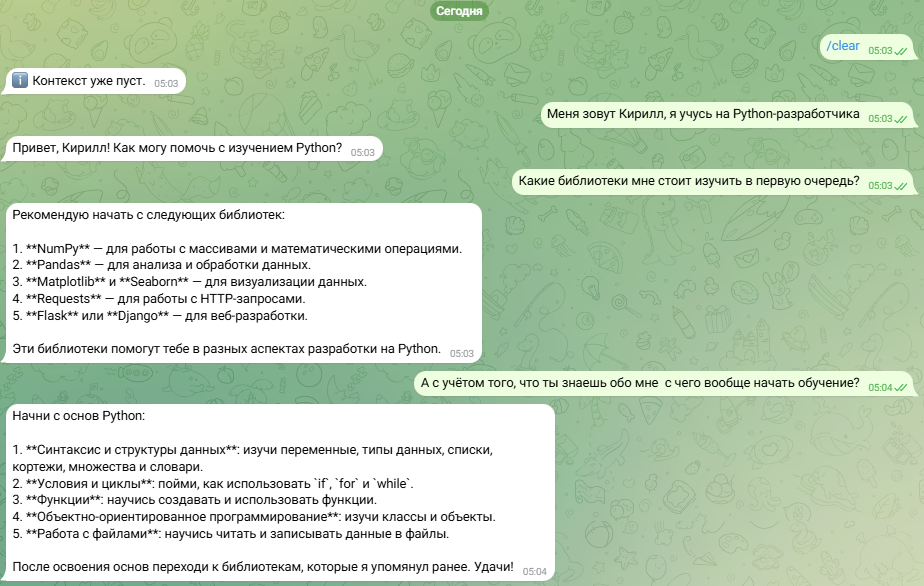
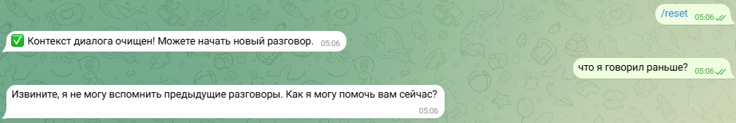
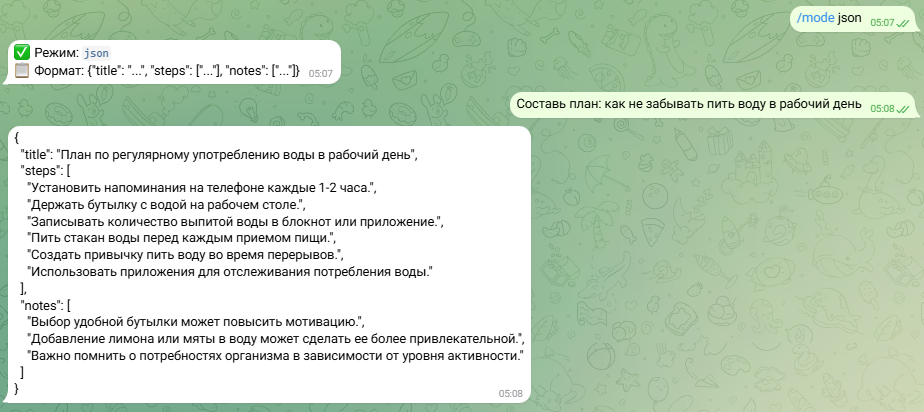
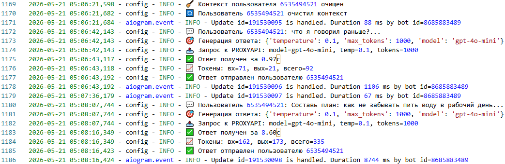
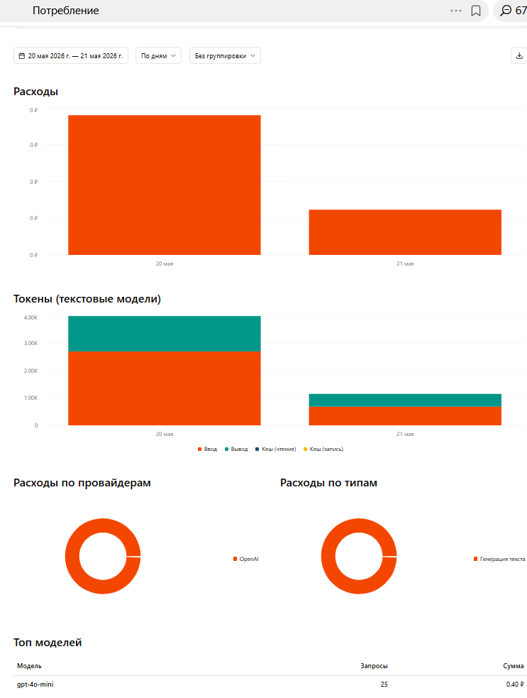

# 🤖 AI Telegram Bot — Prompt Engineering

[](https://python.org)
[](https://docs.aiogram.dev)
[](https://proxyapi.ru)
[](LICENSE)

> Telegram-бот на базе aiogram 3 с поддержкой контекста диалога, сменой режимов промптов и выводом JSON.  
> Реализован в рамках задания по prompt engineering.

---

## 🎯 Задание: Мини-задача и промпт

### Выбранная задача
**«Напоминание пить воду»** — бот по запросу составляет персональный план напоминаний о питьевом режиме и возвращает результат строго в JSON.

---

### 1. Промпт v1 — базовый (до итерации)

**Схема: роль → контекст → задача → формат**

```
Роль: Ты — ассистент, который всегда отвечает валидным JSON.
Контекст: Пользователь запрашивает структурированный ответ.
Задача: Ответь строго в формате JSON без лишнего текста.
Формат: {"title": "...", "steps": ["..."], "notes": ["..."]}
```

**Параметры запуска (ProxyAPI / gpt-4o-mini):**
```
model:       gpt-4o-mini
temperature: 0.2
max_tokens:  500
```

**Пример запроса пользователя:**
```
Составь план: как не забывать пить воду в течение рабочего дня.
```

**Ответ v1 (до итерации):**
```json
{
  "title": "Питьевой режим",
  "steps": [
    "Поставить стакан воды рядом с рабочим местом",
    "Пить воду каждый час",
    "Использовать приложение для напоминаний"
  ],
  "notes": [
    "Норма: 1.5–2 л в день",
    "Кофе не считается"
  ]
}
```

✅ Формат JSON: **да**  
⚠️ Полезность шагов: шаги расплывчатые, нет конкретного расписания  
⚠️ Лаконичность notes: норм, но нет практических советов

---

### 2. Промпт v2 — итерация (few-shot + уточнение роли)

**Улучшения:**
- Уточнена роль: добавлен контекст «health coach»
- Добавлен few-shot пример в системный промпт
- Задача конкретизирована: «рабочий день 9:00–18:00, 8 часов»

```
Роль: Ты — health coach, специализирующийся на питьевом режиме. 
Ты всегда отвечаешь строго валидным JSON без пояснений.
Контекст: Пользователь — офисный работник, рабочий день 9:00–18:00.
Задача: Составь конкретное почасовое расписание приёма воды на рабочий день.
Формат строго:
{"title": "...", "steps": ["чч:мм — действие"], "notes": ["совет до 10 слов"]}
Пример:
{"title": "Питьевой режим: 9–18", "steps": ["09:00 — стакан воды сразу после прихода"], "notes": ["Ставь стакан на видное место"]}
```

**Ответ v2 (после итерации):**
```json
{
  "title": "Питьевой режим: рабочий день 9–18",
  "steps": [
    "09:00 — стакан воды (250 мл) сразу после прихода",
    "10:30 — стакан воды перед кофе-паузой",
    "12:00 — стакан воды до обеда",
    "14:00 — стакан воды после обеда",
    "15:30 — стакан воды в середине второй половины",
    "17:30 — последний стакан перед уходом"
  ],
  "notes": [
    "Держи бутылку 0.5 л на столе всегда",
    "Поставь повторяющееся напоминание в телефоне",
    "Кофе и чай не заменяют воду"
  ]
}
```

✅ Формат JSON: **да**  
✅ Полезность шагов: конкретное расписание по часам, легко выполнить  
✅ Лаконичность notes: 3 коротких совета, каждый до 10 слов

---

### 3. Сравнение: до и после итерации

| Критерий | v1 (базовый) | v2 (после итерации) |
|---|---|---|
| Соответствие JSON-формату | ✅ да | ✅ да |
| Полезность `steps` | ⚠️ расплывчато | ✅ почасовое расписание |
| Лаконичность `notes` | ⚠️ нет практики | ✅ 3 конкретных совета |

**Вывод:** Few-shot + конкретизация роли и временно́го контекста дали структурированный и реально применимый план вместо абстрактных рекомендаций.

---

## 🚀 Быстрый старт

### Требования

- Python 3.10+
- Аккаунт в ProxyAPI / OpenAI / GenAPI

### Установка

```bash
git clone https://github.com/your-username/telegram-ai-bot.git
cd telegram-ai-bot
pip install -r requirements.txt
cp .env.example .env
# Отредактируй .env — добавь BOT_TOKEN и API-ключ
python bot.py
```

### Переменные окружения (`.env`)

```env
# Обязательно
BOT_TOKEN=123456:ABC-DEF1234ghIkl-zyx57W2v1u123ew11

# Хотя бы один из провайдеров (приоритет — ProxyAPI):
PROXYAPI_KEY=px_...
# OPENAI_API_KEY=sk-...
# GENAPI_KEY=gn_...
```

---

## 📱 Команды бота

| Команда | Описание |
|---|---|
| `/start` | Приветствие, информация о провайдере |
| `/reset` | Очистить историю диалога |
| `/info` | Статистика текущей сессии |
| `/temp 0.2` | Изменить температуру генерации |
| `/mode json` | Включить режим JSON-вывода |
| `/mode код` | Режим программиста |
| `/mode анализ` | Режим анализа текста |
| `/mode перевод` | Режим переводчика |
| `/stats` | Статистика токенов и затрат |
| `/clear` | Очистить контекст (алиас `/reset`) |

---

## 🎭 Режимы промптов (`/mode`)

Каждый режим — это предустановленный промпт по схеме «роль → контекст → задача → формат»:

| Режим | Роль | Формат ответа |
|---|---|---|
| `json` | JSON-ассистент | `{"title": "...", "steps": [], "notes": []}` |
| `анализ` | Лингвист-эксперт | Оценка, стиль, структура, рекомендации |
| `код` | Программист/архитектор | Код + объяснение + инструкция + улучшения |
| `перевод` | Переводчик | Перевод + термины + культурный контекст + альтернативы |
| `копирайтинг` | Креативный копирайтер | Заголовок-крючок + текст до 150 слов + CTA + 3 варианта A/B |
| `объяснение` | Преподаватель («объясни как пятилетнему») | Определение + аналогия + пример + «почему важно» |
| `план_проекта` | Project Manager (PMP) | Фазы + временная шкала + ресурсы + топ-3 риска |

---

## 🧱 Структура проекта

```
telegram-ai-bot/
├── bot.py              # Точка входа, aiogram-роутинг
├── config.py           # .env, логика выбора провайдера
├── context_manager.py  # История диалога в памяти (dict по user_id)
├── api_client.py       # Запросы к AI (OpenAI-совместимый формат)
├── prompts.json        # Режимы промптов (роль/контекст/задача/формат)
├── setup_prompts.py    # Утилита просмотра промптов
├── logs/bot.log        # Лог запросов и токенов
├── screenshots/        # Скриншоты для README
├── .env.example
├── requirements.txt
└── README.md
```

---

## 📊 Тестовый отчёт: влияние `temperature`

> Запрос: *«Объясни, что такое рекурсия. Отвечай кратко.»* — gpt-4o-mini

| `temperature` | `max_tokens` | Прогон | Характер ответа | Токены (вх/вых) | ~Стоимость |
|:---:|:---:|:---:|---|:---:|:---:|
| 0.3 | 500 | 1 | Чёткий, структурированный, без лишних слов | 45 / 120 | $0.0002 |
| 0.9 | 500 | 2 | Образный, появляются метафоры и вариации | 48 / 185 | $0.0003 |
| 0.7 | 1000 | 3 | Баланс точности и живости; потолок не достигнут | 52 / 210 | $0.0004 |

**Вывод:** `temperature` 0.2–0.4 — для JSON и технических задач; 0.7–0.9 — для живого диалога.

---

## 🖼 Скриншоты

### Диалог с контекстом

> Бот «помнит» предыдущие сообщения в рамках сессии.

<!-- ВСТАВИТЬ: screenshots/dialog.png -->
<!-- Что показать: переписка минимум из 3 сообщений, бот ссылается на предыдущее -->


---

### Очистка контекста (`/reset`)

> После `/reset` бот забывает всю историю. Проверяется вопросом «что я говорил раньше?»

<!-- ВСТАВИТЬ: screenshots/reset.png -->
<!-- Что показать: команда /reset + следующий вопрос + ответ бота о потере контекста -->


---

### JSON-режим (`/mode json`)

> Запрос плана питьевого режима → строгий JSON-ответ по схеме задания.

<!-- ВСТАВИТЬ: новый скриншот! Включи /mode json, напиши:
     "Составь план: как не забывать пить воду в рабочий день"
     и сфотографируй/захвати ответ бота с JSON -->
<!-- Имя файла: screenshots/json_mode.png -->


---

### Логи в терминале

> Параметры каждого запроса и статистика токенов в реальном времени.

<!-- ВСТАВИТЬ: screenshots/logs.png -->
<!-- Что показать: несколько строк лога с user_id, model, temp, токенами -->


---

### История в кабинете ProxyAPI

> ID запросов, модель, дата — вместо Usage Dashboard OpenAI.

<!-- ВСТАВИТЬ: screenshots/proxyapi_requests.png -->


---

## 🐛 Логирование

Все события пишутся в `logs/bot.log` и дублируются в консоль:

```
[2026-05-18 14:23:01] INFO user_id=123456 | model=gpt-4o-mini | temp=0.2 | mode=json | ctx_msgs=2
[2026-05-18 14:23:02] INFO response_id=chatcmpl-Abc123 | prompt=52 | completion=210 | total=262
[📊 TOKENS] User 123456 | In: 52 | Out: 210 | Total: 262 | Temp: 0.2
```

---

## ⚠️ Замечания

- **Контекст в памяти** — история сбрасывается при перезапуске бота.
- **Таймауты** — запросы до 60 с; бот отправляет статус «печатает…».
- **Безопасность** — `.env` в `.gitignore`, ключи не попадают в репозиторий.

---


📅 Дата: 2026-05-20  
👨‍💻 KirillTomenko